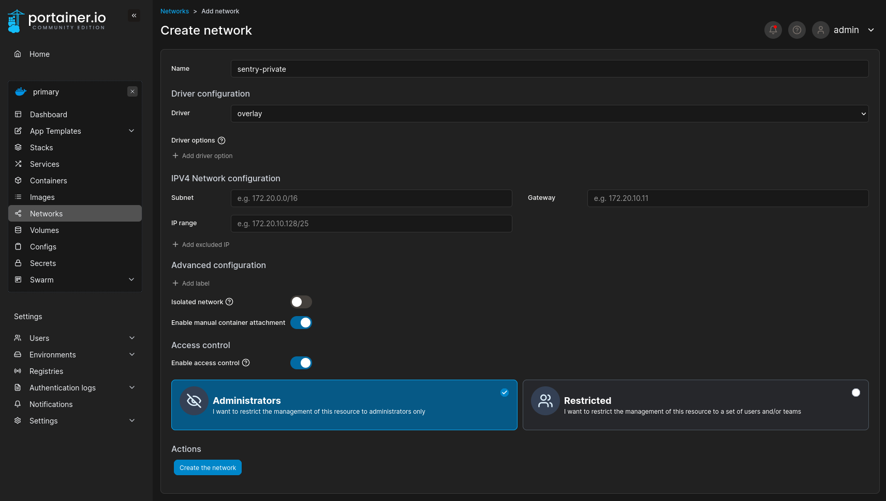

# Docker Swarm Stack Releases

## Setup Portainer

### Create a custom network
Before adding the stack, create a custom overlay network called `sentry-private`. See below screenshot for details.

### Adding a stack
In the environment, add a new stack following these steps:

1. Name the stack according the the docker-compose YAML file name in this repo.
1. Configure the stack to pull from a git repository.
1. Enter in the details for this repo.
    - Repository URL: `https://github.com/Josh5/sentry-docker-swarm`
    - Repository reference: `refs/heads/release/latest`
1. Enter the name of the the docker-compose YAML file.
1. Enable GitOps updates.
1. Configure Polling updates with an interval of `5m`.
1. Configure Environment Variables. These are notated in the header of the docker-compose YAML file.
