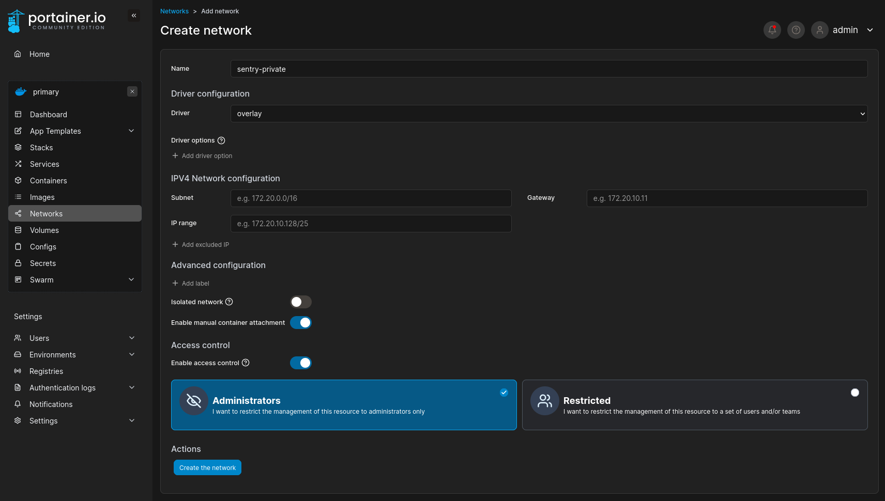

# Docker Swarm Stack Releases

## Setup Portainer

### Create a custom network

Before adding the stack, create a custom overlay network called `sentry-private`. See below screenshot for details.

### Adding a stack

In the environment, add a new stack following these steps:

1. Name the stack according the docker-compose YAML file name in this repo.
1. Configure the stack to pull from a git repository.
1. Enter in the details for this repo.
   - Repository URL: `<url>`
   - Repository reference: `refs/heads/<branch>`
1. Enter the name of the docker-compose YAML file.
1. Enable GitOps updates.
1. Configure Polling updates with an interval of `5m` (or whatever value you like).
1. Configure Environment Variables. These are notated in the header of the docker-compose YAML file.

## Sentry Config Vars

These variables configure the upstream `getsentry/self-hosted` stack that the manager downloads and runs. They are distinct from manager-only variables such as Docker version selection, log monitoring controls, or DIND resource limits.

Where practical, the defaults here are intended to align with upstream self-hosted behavior. When a variable is left unset in this project, the manager generally preserves the upstream self-hosted default by copying upstream `.env` into `.env.custom` first and only writing overrides when a value is explicitly provided.

References:

- Upstream self-hosted releases: <https://github.com/getsentry/self-hosted/releases>
- Upstream self-hosted docs: <https://develop.sentry.dev/self-hosted/>

#### Core Settings

`SENTRY_BEACON_DISABLED` (optional)

- Default: `true`
- Description: Controls Sentry self-hosted telemetry beacon behavior.
- Notes: This project writes `SENTRY_BEACON=False` into `sentry.conf.py` when enabled.

`SENTRY_SECRET_KEY`

- Description: Sets Sentry’s system secret key.
- Notes: Keep this stable across restarts and upgrades.
- References:
  - <https://develop.sentry.dev/self-hosted/configuration/>

`SENTRY_URL_PREFIX`

- Description: Public base URL for the Sentry installation, for example `https://sentry.example.com`.
- Notes: Used for generated links, auth flows, and external integrations.

`SENTRY_COMPOSE_PROFILES` (optional)

- Default: `feature-complete`
- Accepted Values:
  - `feature-complete` => Includes all services.
  - `errors-only` => A major footprint reduction lever if you do not need traces, replays, profiling, uptime, and related services.
- Description: Sets Sentry compose profile.
- References:
  - <https://develop.sentry.dev/self-hosted/optional-features/errors-only/>

`SENTRY_INITIAL_ADMIN_EMAIL` (optional)

- Description: Used by this project when creating the initial admin account.

### Database Settings

`SENTRY_CUSTOM_DB_CONFIG` (optional)

- Default: `false`
- Description: Enables writing custom Postgres connection settings into `sentry.conf.py`.
- Notes: Leave this `false` when using the bundled upstream Postgres.

`SENTRY_DB_NAME` (optional)

- Default: `postgres`
- Description: Database name for custom DB deployments.

`SENTRY_DB_USER` (optional)

- Default: `postgres`
- Description: Database user for custom DB deployments.

`SENTRY_DB_PASSWORD` (optional)

- Description: Database password for custom DB deployments.

`SENTRY_POSTGRES_HOST` (optional)

- Default: `postgres`
- Description: Hostname for custom DB deployments.

`SENTRY_POSTGRES_PORT` (optional)

- Default: `5432`
- Description: Port for custom DB deployments.

### Event Retention And Storage

`SENTRY_EVENT_RETENTION_DAYS` (optional)

- Default: `90`
- Description: Controls how long Sentry retains event data.
- Notes: This also influences upstream SeaweedFS lifecycle policy setup for the nodestore bucket (the nodestore bootstrap script sets SeaweedFS lifecycle based on this value).
- References:
  - <https://github.com/getsentry/self-hosted/issues/4353>

`FORCE_NODESTORE_READ_THROUGH` (optional)

- Default: `false`
- Description: Project-specific compatibility override for nodestore migration/read behavior.
- Notes: Only use if you know you need read-through enabled after nodestore migration work.
- References:
  - <https://github.com/getsentry/self-hosted/issues/3960>

`FORCE_NODESTORE_DELETE_THROUGH` (optional)

- Default: `false`
- Description: Project-specific compatibility override paired with `FORCE_NODESTORE_READ_THROUGH`.
- Notes: Only use when migrating or reconciling nodestore behavior and you understand the impact.

`SENTRY_FILESTORE_BACKEND_S3_BUCKET` (optional)

- Description: Enables custom S3 filestore backend configuration in `config.yml`.
- Notes: Leave unset to keep the upstream default filestore behavior.

### Worker And Queue Processing

`SENTRY_TASKWORKER_CONCURRENCY` (optional)

- Default: `4`
- Description: Controls the concurrency of the main Sentry taskworker process.
- Notes: This is one of the safest first throughput knobs to raise if async task backlog is the actual bottleneck. Higher values increase CPU and memory pressure.

`LAUNCHPAD_TASKWORKER_CONCURRENCY` (optional)

- Default: `4`
- Description: Controls concurrency of the `launchpad-taskworker` container introduced in newer self-hosted releases.
- Notes: Only matters on releases that include Launchpad support. For `26.5.0` and higher, this applies to the `launchpad-taskworker` container added during the hard-stop transition.
- References:
  - <https://github.com/getsentry/self-hosted/releases/tag/26.5.0>
  - <https://github.com/getsentry/self-hosted/releases/tag/26.6.0>

`LAUNCHPAD_RPC_SHARED_SECRET` (optional)

- Default: `supersecret`
- Description: Security secret key for Launchpad/taskbroker RPC wiring.
- Notes: This project strongly recommends overriding it with a unique high-entropy secret for real deployments. Relevant for Sentry versions `26.5.0` and higher.
- References:
  - <https://github.com/getsentry/self-hosted/releases/tag/26.5.0>
  - <https://github.com/getsentry/self-hosted/releases/tag/26.6.0>

`SENTRY_KAFKA_MAX_POLL_INTERVAL_MS` (optional)

- Default: `300000`
- Description: Max poll interval in milliseconds used across Sentry and Snuba Kafka consumers.
- Notes: This is mainly a consumer stability knob, not a raw throughput knob. Raise it when long-processing consumers are being evicted with `MAXPOLL`-style behavior. Relevant for Sentry `26.6.0` and higher.
- References:
  - <https://github.com/getsentry/self-hosted/pull/4376>

### Kafka Retention And Disk Control

Kafka disk storage growth is one of the most common operational challenges in self-hosted Sentry deployments. The configuration options below allow operators to tune Kafka's log retention, segment roll timings, and cleanup policies to keep disk usage within bounds.

For further details, troubleshooting, refer to these resources:

- **Upstream Kafka Troubleshooting Guide**: [Sentry Documentation](https://develop.sentry.dev/self-hosted/troubleshooting/kafka/)
- **Sentry Kafka Disk Growth Issues**: [GitHub Issue #3389](https://github.com/getsentry/self-hosted/issues/3389) and [GitHub Issue #3691](https://github.com/getsentry/self-hosted/issues/3691)
- **Community Support Threads**: [Sentry Forum: Restricting Kafka Disk Usage](https://forum.sentry.io/t/restrict-kafka-disk-usage/9838) and [Sentry Forum: Cleanup Guidance](https://forum.sentry.io/t/sentry-disk-cleanup-kafka/11337/2?u=byk)
- **Kafka Space Management Reference**: [Managing Disk Space](https://iv-m.github.io/articles/kafka-limit-disk-space/)

`KAFKA_LOG_RETENTION_HOURS` (optional)

- Default: `24`
- Description: Sets time-based Kafka log retention.
- Notes: This aligns with upstream self-hosted troubleshooting guidance.
- References:
  - <https://docs.confluent.io/platform/current/installation/configuration/broker-configs.html#log-retention-hours>

`KAFKA_LOG_RETENTION_BYTES` (optional)

- Default: `1073741824` (1 GiB)
- Description: Sets byte-based Kafka log retention limits.
- Notes: Useful when you want tighter control over Kafka disk growth. Note that storage limits apply per partition/log rather than acting as a single overall stack cap.
- References:
  - <https://docs.confluent.io/platform/current/installation/configuration/broker-configs.html#log-retention-bytes>

`KAFKA_LOG_SEGMENT_BYTES` (optional)

- Default: `524288000`
- Description: Controls segment size before Kafka rolls to a new segment.
- Notes: This affects cleanup granularity and how quickly retention policies can reclaim space.
- References:
  - <https://docs.confluent.io/platform/current/installation/configuration/broker-configs.html#log-segment-bytes>

`KAFKA_LOG_RETENTION_CHECK_INTERVAL_MS` (optional)

- Default: `300000`
- Description: Controls how often Kafka checks whether segments should be deleted due to retention rules.
- References:
  - <https://docs.confluent.io/platform/current/installation/configuration/broker-configs.html#log-retention-check-interval-ms>

`KAFKA_LOG_SEGMENT_DELETE_DELAY_MS` (optional)

- Default: `60000`
- Description: Delay before deleting old log segments after they become eligible for deletion.
- References:
  - <https://docs.confluent.io/platform/current/installation/configuration/broker-configs.html#log-segment-delete-delay-ms>

`KAFKA_LOG_CLEANER_ENABLE` (optional)

- Default: `true`
- Description: Enable the log cleaner process.
- Notes: Useful as part of an aggressive “keep Kafka disk bounded” posture.
- References:
  - <https://develop.sentry.dev/self-hosted/troubleshooting/kafka/>

`KAFKA_LOG_CLEANUP_POLICY` (optional)

- Default: `delete`
- Description: Cleanup policy for old segments.
- Notes: Pairs naturally with retention-based disk control. Useful when you want Kafka to behave like a bounded buffer rather than a long-lived retained log.
- References:
  - <https://develop.sentry.dev/self-hosted/troubleshooting/kafka/>

### Mail And User Verification

> [!NOTE]
> For `26.6.0` and higher, working outbound mail is called out more explicitly upstream because user email verification flows matter operationally.

`SENTRY_CUSTOM_MAIL_SERVER_CONFIG` (optional)

- Default: `false`
- Description: Enables writing SMTP settings directly into `config.yml`.

`SENTRY_EMAIL_HOST` (optional)

- Description: SMTP host address when `SENTRY_CUSTOM_MAIL_SERVER_CONFIG=true`.

`SENTRY_EMAIL_PORT` (optional)

- Description: SMTP port when `SENTRY_CUSTOM_MAIL_SERVER_CONFIG=true`.

`SENTRY_EMAIL_USER` (optional)

- Description: SMTP username when `SENTRY_CUSTOM_MAIL_SERVER_CONFIG=true`.

`SENTRY_EMAIL_PASSWORD` (optional)

- Description: SMTP password when `SENTRY_CUSTOM_MAIL_SERVER_CONFIG=true`.

`SENTRY_EMAIL_USE_TLS` (optional)

- Description: SMTP STARTTLS toggle when `SENTRY_CUSTOM_MAIL_SERVER_CONFIG=true`.

`SENTRY_EMAIL_USE_SSL` (optional)

- Description: SMTP SSL toggle when `SENTRY_CUSTOM_MAIL_SERVER_CONFIG=true`.

`SENTRY_SERVER_EMAIL` (optional)

- Description: Sender/from address written into Sentry config.

`SENTRY_MAIL_HOST` (optional)

- Description: Mail namespace / hostname used by upstream mail settings when not using full custom SMTP config.

### GitHub Integration

`SENTRY_GITHUB_LOGIN_EXTENDED_PERMISSIONS` (optional)

- Default: `repo`
- Description: Sets extended GitHub login permissions for GitHub integration behavior.

`SENTRY_GITHUB_APP_ID` (optional)

- Description: GitHub App ID for GitHub App integration.

`SENTRY_GITHUB_APP_NAME` (optional)

- Description: GitHub App name.

`SENTRY_GITHUB_APP_WEBHOOK_SECRET` (optional)

- Description: Optional GitHub App webhook secret.

`SENTRY_GITHUB_APP_CLIENT_ID` (optional)

- Description: GitHub App client ID.

`SENTRY_GITHUB_APP_CLIENT_SECRET` (optional)

- Description: GitHub App client secret.

`SENTRY_GITHUB_APP_PRIVATE_KEY` (optional)

- Description: GitHub App private key material.

### Ingest Filter Settings

`SENTRY_INGEST_FILTER_ENABLED` (optional)

- Default: `false`
- Description: Enable the Sentry ingest proxy and flood control filter layer.

`SENTRY_INGEST_FILTER_MODE` (optional)

- Default: `observe`
- Accepted Values:
  - `observe` => Only log decisions to stdout.
  - `sample` => Rate limit matching signatures and apply a post-limit sample rate.
  - `trim` => Trim heavy fields (like breadcrumbs) for rate-limited event signatures.
  - `drop` => Silently drop events exceeding limits.
- Description: Ingest filter mode.

`SENTRY_INGEST_FILTER_WINDOW_MINUTES` (optional)

- Default: `1440` (24 hours)
- Description: Time window in minutes to evaluate rate limits.

`SENTRY_INGEST_FILTER_MAX_EVENTS_PER_SIGNATURE` (optional)

- Default: `5000`
- Description: Max event count threshold per signature inside the window before rate limiting/sampling applies.

`SENTRY_INGEST_FILTER_SAMPLE_RATE_AFTER_LIMIT` (optional)

- Default: `0.01` (1%)
- Description: Sample rate applied to matching event signatures after exceeding the max events threshold.

`SENTRY_INGEST_FILTER_INCLUDE_ENVIRONMENT` (optional)

- Default: `true`
- Description: Include environment tag when generating event signature hashes.

`SENTRY_INGEST_FILTER_INCLUDE_RELEASE` (optional)

- Default: `false`
- Description: Include release version when generating event signature hashes.

`SENTRY_INGEST_FILTER_TRIM_MAX_BREADCRUMBS` (optional)

- Default: `5`
- Description: Trim breadcrumbs down to this max size if `FILTER_MODE` is set to `trim`.

`SENTRY_INGEST_FILTER_SNAPSHOT_INTERVAL` (optional)

- Default: `1m`
- Description: Frequency at which signature rate-limit state snapshots are saved to disk.

`SENTRY_INGEST_FILTER_METRIC_LOG_INTERVAL` (optional)

- Default: `1m`
- Description: Frequency of writing stats metrics log lines to stdout.

`SENTRY_INGEST_FILTER_BUFFER_ENABLED` (optional)

- Default: `false`
- Description: Buffer events to disk when the upstream is down.

`SENTRY_INGEST_FILTER_BUFFER_MAX_BYTES` (optional)

- Default: `1073741824` (1 GiB)
- Description: Max storage buffer size in bytes.

`SENTRY_INGEST_FILTER_RETRY_INITIAL_BACKOFF` (optional)

- Default: `5s`
- Description: Initial wait duration before retrying connection to upstream.

`SENTRY_INGEST_FILTER_RETRY_MAX_BACKOFF` (optional)

- Default: `2m`
- Description: Maximum wait duration when retrying connection to upstream.

`SENTRY_INGEST_FILTER_RETRY_SWEEP_INTERVAL` (optional)

- Default: `5s`
- Description: Frequency of scanning and draining the disk queue buffer.

`SENTRY_INGEST_FILTER_LOG_DECISIONS` (optional)

- Default: `false`
- Description: Log all filter keep/drop decision results to stdout.

`SENTRY_INGEST_FILTER_DEBUG` (optional)

- Default: `false`
- Description: Enable debug verbose logging.

### Logging And Advanced Escape Hatches

`SENTRY_LOG_FORMAT` (optional)

- Default: `human`
- Accepted Values:
  - `machine` => JSON-style logs
  - `human` => human-readable logs
- Description: Controls upstream Sentry logging format in `.env`.
- References:
  - <https://github.com/getsentry/sentry/blob/26.6.0/src/sentry/logging/README.rst#formats>

`SENTRY_CONF_CUSTOM` (optional)

- Description: Appends arbitrary extra Python config to generated `sentry.conf.py`.
- Notes: Use for advanced features not promoted to first-class vars in this project.

`SENTRY_ENV_CUSTOM` (optional)

- Description: Appends arbitrary extra `.env` lines to upstream `.env.custom`.
- Notes: Use for advanced upstream env settings that are intentionally not first-class here. Fallback for less common Kafka settings, experimental tuning, or one-off upstream flags.
